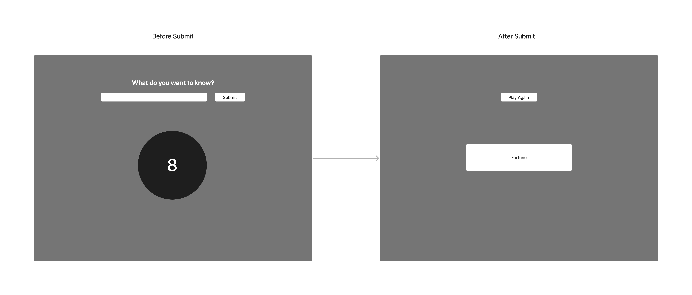

## Plan:

Fortune Teller App

## Functionality:

1. **User inputs question into textbox**
1. **User clicks button to get fortune**
1. **Fortune is displayed**
1. **Try again button is displayed**

## HTML Elements:

-   `<input>` Text input for question
-   `<button>` Button to trigger fortune
-   `` Image for 8ball
-   `<h2>` Header "Magic 8-Ball Says..."
-   `
` Paragraph for fortune
-   `<button>` Button to reset

## State variables (JavaScript)

-   Fortune

## Events (JavaScript)

-   Button click to generate fortune

    -   pick random fortune
    -   remove 8 ball img, text box, submit button
    -   display fortune
    -   display “play again” button

-   Button click to play again
    -   remove fortune, "play again" button
    -   display original state

## Wireframe

